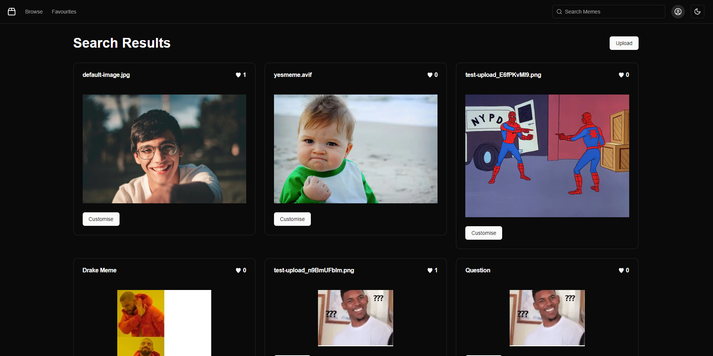
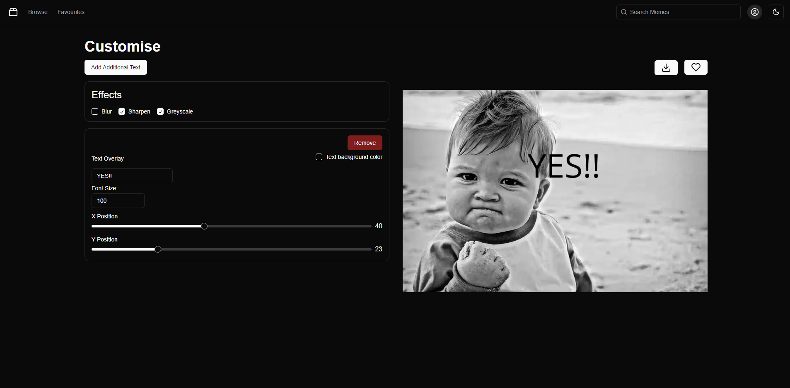

# Meme Gen

#### Home Page



#### Customise Page




## Deployed Version

* [Link]( https://meme-gen-edric.vercel.app/)

## Setup

* To install dependencies open terminal cd into the root folder
 ```
 npm install
 ```
* Setup env variables in a .env file
```
# Image kit
NEXT_PUBLIC_PUBLIC_KEY=""
NEXT_PUBLIC_URL_ENDPOINT=""
PRIVATE_KEY=""
# Database url
DRIZZLE_DATABASE_URL=""
# Google Oauth
AUTH_SECRET=""
AUTH_GOOGLE_ID=""
AUTH_GOOGLE_SECRET=""
```
 * Run Application
 ```
 npm run dev
 ```

### Outline
This project aim is create a web app to generate memes

### Stack
  NextJS - TailwindCSS - Shadcn - Imagekit - Neon - Auth.js - DrizzleORM

## Features
  - Users are able to OAuth login with google
  - Users are able search for memes
  - Users are able upload memes
  - Users are able customise memes (Add text overlays, modify each text background ,and add blur/sharpen/greyscale effects)
  - Users are able favourite memes and view these memes

## Interesting
  - Debounce call backs were used to prevent the spam of image updates.
  - [Use Debounce library](https://www.npmjs.com/package/use-debounce)


## Stay in touch

*  [Portfolio]( https://edric-khoo.vercel.app/)
*  [Linkedin]( https://www.linkedin.com/in/edric-khoo-98881b173/)


